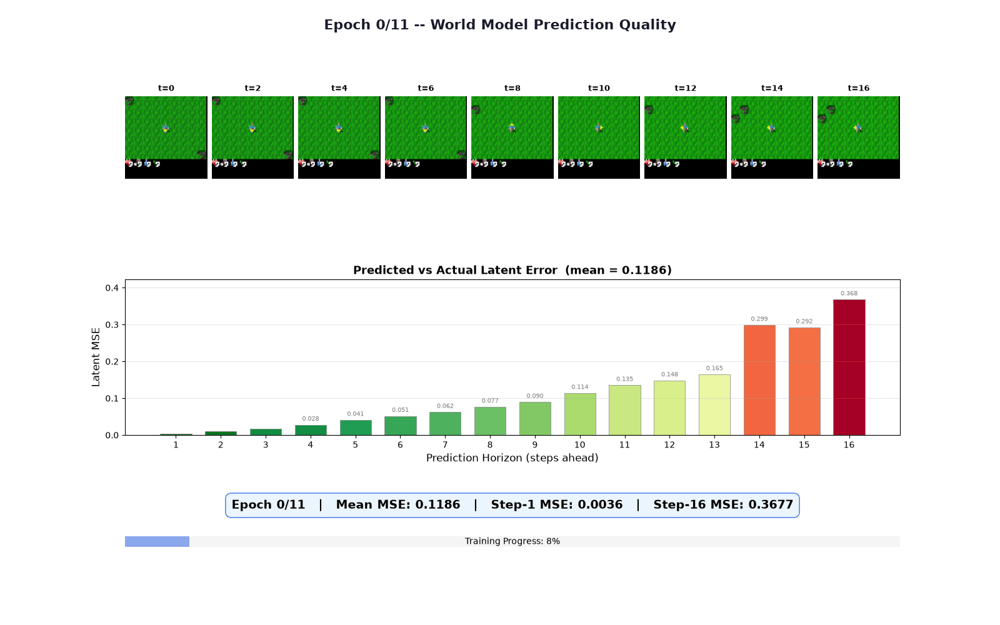
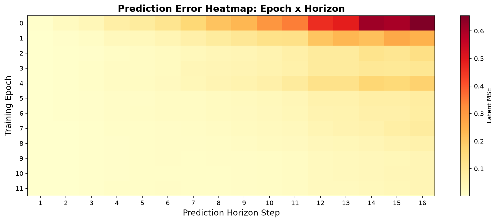
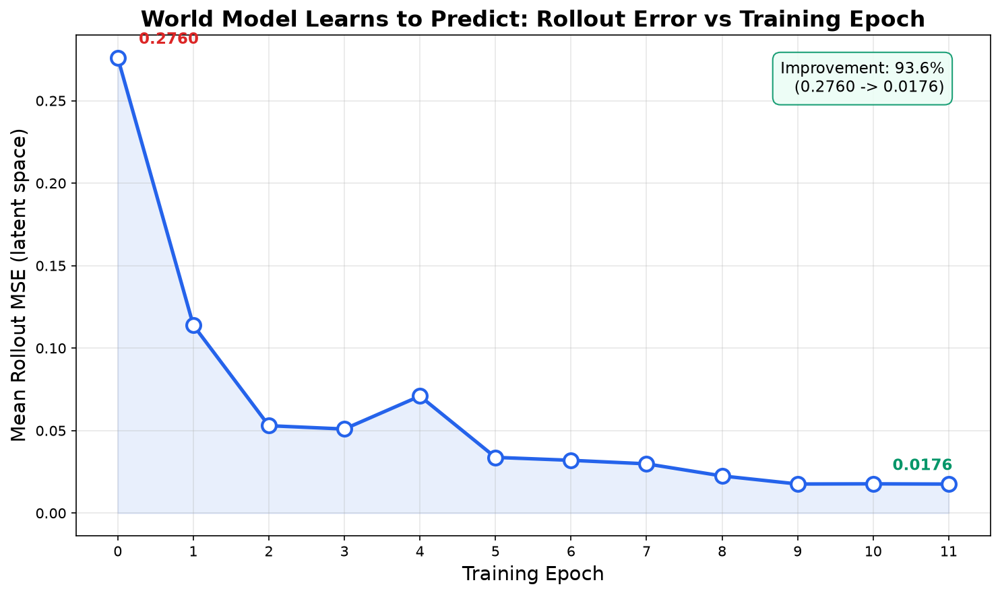
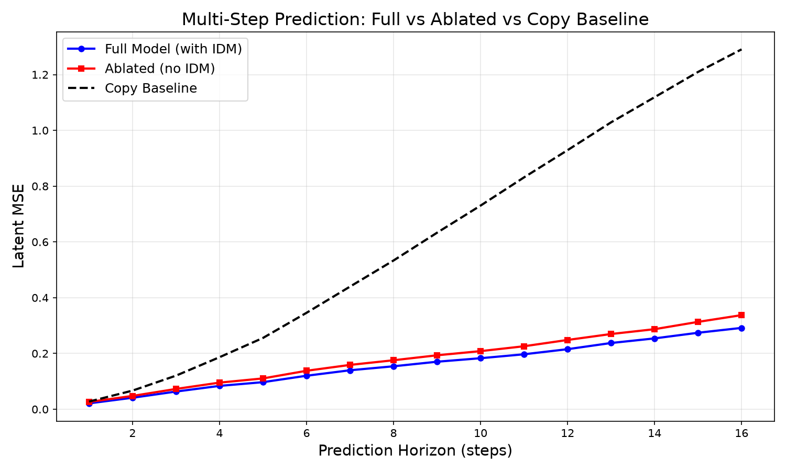
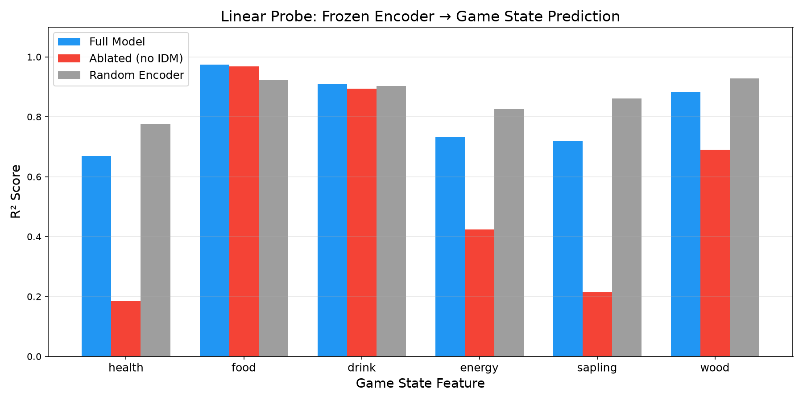
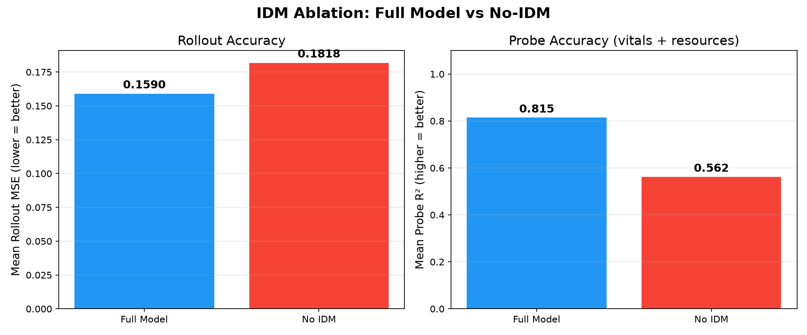
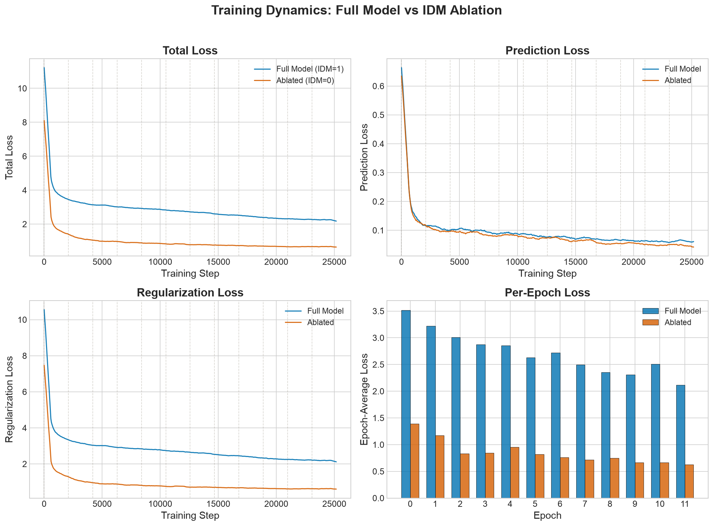
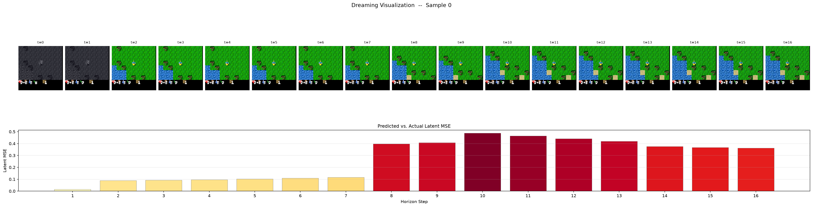

# LeCrafter

> **Hack The World(s) 2026** · Team Dreaming Machines
>
> Built on [EB-JEPA](https://github.com/facebookresearch/eb_jepa) (Meta FAIR) · [Paper](https://arxiv.org/abs/2602.03604)

Can a JEPA learn to **understand** a Minecraft-like survival world — without reward signals, labels, or pixel reconstruction?

We port Meta FAIR's Energy-Based JEPA from a simple 2D toy environment (Two Rooms) to **Crafter**, a procedurally-generated survival game with 17 actions, inventory management, enemies, and crafting. The model learns an abstract latent representation of the world purely from random exploration, and we prove it captures meaningful game state.

---

## Why JEPA? The LeCun Thesis

Most world models reconstruct pixels (like Dreamer). JEPA takes a radically different approach: **predict in latent space, not pixel space**. The encoder compresses observations into abstract representations, and the predictor operates entirely in that compressed space. No decoder is ever needed.

Why does this matter? Pixel-level prediction wastes capacity on textures, lighting, and irrelevant visual details. A latent predictor can focus on what actually changes in the world — the agent moved, a tree was chopped, health decreased. This is LeCun's thesis: *understand the structure of the world, don't memorize its appearance.*

## Why Crafter?

The original EB-JEPA was demonstrated on **Two Rooms** — a dot navigating two rooms with a wall and door. 2 continuous actions, deterministic physics, 65×65 grayscale. It's a proof of concept, not a test of real-world complexity.

**Crafter** is a different beast entirely:
- **17 discrete actions** (move, craft, fight, sleep, place)
- **Procedurally-generated worlds** — every episode has different terrain, resource placement, and enemy spawns
- **Survival mechanics** — health, food, drink, energy that deplete over time
- **Inventory and crafting** — collect wood/stone/iron, craft tools and weapons
- **Enemies** — zombies and skeletons that attack at night
- **64×64 RGB** observations with complex visual semantics

The question: does the JEPA architecture — designed for a toy world — scale to this complexity?

## Architecture & Design Choices

```
Crafter RGB (64×64×3)
    │
    ▼
ImpalaEncoder (3 ResNet stacks, MaxPool)
    │
    ▼
512-dim latent [B, 512, T, 1, 1]
    │                    ┌─────────────────────┐
    ▼                    │ nn.Embedding(17, 32)│
GRU Predictor ◄────────  │ (discrete actions)  │
    │                    └─────────────────────┘
    ▼
Next latent state
    │
    ├──► VCReg (variance + covariance regularization)
    ├──► Temporal Similarity loss
    └──► IDM (Inverse Dynamics Model, cross-entropy)
```

### Key architectural decisions and why

**1. Discrete action encoder: `nn.Embedding(17, 32)`**

Two Rooms uses continuous 2D actions passed directly to the GRU (`nn.Identity()`). Crafter has 17 discrete actions — "move left", "place stone", "make iron sword", etc. We embed each action into a learned 32-dimensional vector. The GRU predictor receives these embeddings as input, so it learns action-conditioned dynamics in a continuous space. 32 dims is enough to differentiate 17 actions while keeping the predictor lightweight.

**2. IDM head: 17 logits + cross-entropy (not MSE)**

The Inverse Dynamics Model predicts *which action caused a state transition*. In Two Rooms, it regresses 2 continuous action values with MSE. For discrete Crafter actions, we output 17 logits and use cross-entropy classification. This is the natural loss for categorical targets and gives cleaner gradients than treating action IDs as regression targets.

**3. ImpalaEncoder preserved (not ResNet/ViT)**

We keep the ImpalaEncoder from the original — 3 ResNet stacks with MaxPool, producing a flat 512-dim latent via a linear projection. It's fast, proven on RL environments (DeepMind's IMPALA agent), and already integrated with the JEPA training loop. Going bigger (ResNet-50, ViT) would be premature for a 64×64 input and a 24h hackathon.

**4. VCReg + IDM regularization (critical, not optional)**

The EB-JEPA paper shows that without regularization, the encoder **collapses** — it maps everything to the same representation, achieving zero prediction error by being useless. VCReg (variance + covariance) prevents this by encouraging diverse, decorrelated features. The IDM loss forces features to be *action-relevant* — if two states look the same to the encoder but different actions connect them, the encoder must learn to distinguish them. Our ablation confirms this is load-bearing in Crafter too.

**5. Autoregressive unroll with GRU (not parallel Conv)**

The predictor is a GRU that steps forward one timestep at a time, feeding its own output back as input. This is necessary for planning (imagining multi-step futures from a single frame) and matches how the model would be used at inference. The alternative — parallel convolution — requires ground-truth frames at every step and can't extrapolate.

## Data: Learning from Random Exploration

We collect **1000 episodes** (~170k transitions) of a random policy playing Crafter. No reward shaping, no curriculum, no expert demonstrations — just uniform random actions.

Why random? We're training a **world model**, not an agent. We need diverse state coverage: different terrains, day/night, various inventory states, encounters with enemies. A random policy naturally visits a wide range of states. A trained agent would be biased toward optimal play paths, which is actually *worse* for learning general dynamics.

Each transition stores: RGB observation (64×64×3, uint8), discrete action (int 0-16), and 16 game-state labels (health, food, drink, energy, 6 resource counts, 6 tool flags) for later probe evaluation.

**Per-channel z-score normalization** is mandatory — the VCReg loss assumes zero-mean inputs. Without it, the encoder can cheat by encoding the global color bias.

## Training

- **12 epochs** on 1000 episodes (~170k transitions)
- **NVIDIA GB200 GPU** (Grace-Blackwell, aarch64) at the Dalia cluster
- **~44 minutes** per training run
- **bfloat16** mixed precision, batch size 64, 8-step autoregressive rollout
- **3 runs:** Full model (2 seeds) + IDM ablation (idm_coeff=0)
- AdamW optimizer, lr=0.001, cosine warmup schedule

## What we changed from Two Rooms

| Component | Two Rooms (original) | Crafter (ours) |
|-----------|---------------------|----------------|
| Actions | 2 continuous (`nn.Identity`) | 17 discrete (`nn.Embedding(17, 32)`) |
| IDM loss | MSE regression | Cross-entropy classification |
| Observations | 2-channel 65×65 | 3-channel RGB 64×64 |
| Data | On-the-fly simulation | Pre-collected offline trajectories (.npz) |
| Probe | XY position (2D) | 16 game state features (health, inventory) |
| Environment | Dot + wall + door | Survival game with enemies, inventory, crafting |

---

## Results

### Watch the model learn (93.6% improvement in 12 epochs)

<p align="center">
  
</p>

Each frame = one training epoch. The bars show prediction error at each horizon step. **Watch them collapse to near-zero** as the model learns to imagine the future. Epoch 0: MSE=0.276 (can't predict). Epoch 11: MSE=0.018 (accurate 16 steps ahead).

<p align="center">
  
  
</p>

### The model learns to imagine the future

The JEPA predictor autoregressively rolls out future latent states given actions. It achieves **3.8x lower error** than simply repeating the current state:

<p align="center">
  
</p>

| Model | Mean Latent MSE | vs Copy Baseline |
|-------|----------------|------------------|
| **Full JEPA (with IDM)** | **0.159** | **3.8x better** |
| Ablated (no IDM) | 0.182 | 3.3x better |
| Copy Baseline | 0.609 | — |

### The latent encodes game state without labels

A frozen linear probe on top of the encoder predicts health, food, drink, energy, and inventory — features the model was **never trained to predict**:

<p align="center">
  
</p>

### IDM loss is critical

Removing the Inverse Dynamics Model loss degrades both prediction accuracy and representation quality:

<p align="center">
  
</p>

- Rollout MSE: 0.159 → 0.182 (**+14% worse**)
- Probe R²: 0.815 → 0.562 (**-31% drop**)
- Health probe collapses: 0.67 → 0.19 (**-71%**)

### The encoder understands time (dynamics probes)

Standard inventory probes (health, food) are surprisingly easy for random ConvNets — they just read pixel bars. We designed probes that test **dynamics understanding** that only a trained encoder should have:

| Probe | Trained | Random | Delta | What it tests |
|-------|---------|--------|-------|---------------|
| **Temporal Ordering** | **88.2%** | 66.7% | **+21.6%** | Can it tell which frame came first? |
| Action Prediction (IDM) | 24.0% | 23.0% | +1.0% | Can it predict which action was taken? |
| Next-State Cosine Sim | 0.991 | 0.992 | -0.001 | Are latent transitions structured? |

The **temporal ordering result** is the clearest differentiator: the trained encoder knows "this frame came before that one" — it captured the arrow of time in the game world. Random features can't do this.

### The model plays via imagination

Using the world model as a mental simulator, a planning agent acts in Crafter. We built two versions:

**v1: Random Shooting** — sample 200 random action sequences, pick the most novel future
**v2: Discrete CEM** — Cross-Entropy Method with 300 samples, 30 elites, 5 iterations, horizon 20 steps. Uses probe-based objectives (survival, resources, composite).

| Achievement | Random Policy | v1 (exploration) | v2 CEM (survival) | v2 CEM (composite) |
|-------------|--------------|-------------------|--------------------|--------------------|
| **wake_up** | ~50% | 94% | 90% | **100%** |
| **collect_wood** | ~3% | 2% | 30% | **36%** |
| **collect_sapling** | ~15% | 48% | 26% | **32%** |
| **place_plant** | ~10% | 40% | 20% | **28%** |
| **collect_drink** | ~1% | 0% | 2% | **6%** |
| Mean reward | ~0.3 | 0.90 | 0.77 | **1.12** |

The v2 CEM composite planner achieves **100% wake_up** and **36% wood collection** — a dramatic improvement over random policy. It plans by imagining futures and steering toward states where the probe predicts high health + resources. No reward signal, no RL training — pure imagination.

**Crafter score: 0.00** (geometric mean — any zero-achievement among 22 kills it). The agent successfully performs 5 different achievements but never reaches the 17 others (crafting, combat) because our world model was trained on random-policy data that never demonstrates those behaviors.

### Training dynamics

<p align="center">
  
</p>

The full model (blue) maintains higher regularization loss than the ablated model (orange) — the IDM term forces the encoder to work harder. Both converge on prediction loss, but the ablated model's representations are less informative (proven by probes above).

### The model "dreams"

Given a single starting frame and a sequence of actions, the model imagines what will happen:

<p align="center">
  
</p>

## Current Dataset

| | Random Policy (current) | PPO Policy (planned, M1) |
|---|---|---|
| Episodes | 1000 | 500 PPO + 500 random |
| Transitions | ~170k | ~300k |
| Mean episode length | 170 steps | ~250 steps (trained survives longer) |
| Coverage of rare states | Poor (no tools, no iron) | Good (crafting, combat, tools) |
| Collection time | 15 min | ~1h (30min PPO training + 30min collection) |

The random policy gives diverse terrain/movement coverage but never reaches deep game states (crafting chains, combat). The PPO data collection script (`collect_ppo_data.py`) trains a basic PPO agent first, then collects trajectories from it — this would dramatically improve probe accuracy on rare features.

## Quick Start

```bash
# 1. Install
pip install -e .
pip install crafter

# 2. Collect data (~5 min, 1000 episodes of random play)
python scripts/collect_crafter_data.py --output_dir data/crafter_trajectories --num_episodes 1000

# 3. Train (~44 min on single GPU)
python -c "
from examples.ac_video_jepa.main import run
run(fname='examples/ac_video_jepa/cfgs/crafter.yaml',
    **{'data.data_dir': 'data/crafter_trajectories', 'logging.log_wandb': False})
"

# 4. Train IDM ablation
python -c "
from examples.ac_video_jepa.main import run
run(fname='examples/ac_video_jepa/cfgs/crafter.yaml',
    **{'data.data_dir': 'data/crafter_trajectories', 'model.regularizer.idm_coeff': 0, 'logging.log_wandb': False})
"

# 5. Evaluate
python scripts/eval_probe.py --checkpoint_path checkpoints/.../latest.pth.tar --data_dir data/crafter_trajectories
python scripts/eval_rollout.py --checkpoint_path checkpoints/.../latest.pth.tar --data_dir data/crafter_trajectories
```

### SLURM (Dalia cluster)
```bash
sbatch scripts/train_crafter.sh              # Full model
sbatch scripts/train_crafter.sh --ablation   # IDM ablation
sbatch scripts/train_crafter.sh --seed 1000  # Second seed
sbatch scripts/run_all_evals.sh              # All evaluations
```

## Project Structure

```
eb_jepa/
├── eb_jepa/
│   ├── action_encoders.py          # NEW: Discrete action embedding
│   ├── architectures.py            # ImpalaEncoder, RNNPredictor, IDM
│   ├── jepa.py                     # JEPA class (modified for discrete actions)
│   ├── losses.py                   # VCReg + IDM loss (added cross-entropy mode)
│   └── datasets/
│       ├── crafter/                # NEW: Crafter dataset pipeline
│       │   ├── crafter_dataset.py  # TrajDataset + SlicedDataset
│       │   ├── normalizer.py       # Per-channel z-score normalization
│       │   └── data_config.yaml
│       └── utils.py                # Modified: added crafter dispatch
├── examples/ac_video_jepa/
│   ├── main.py                     # Modified: discrete action builder
│   └── cfgs/crafter.yaml           # NEW: Crafter training config
├── scripts/
│   ├── collect_crafter_data.py     # Data collection (random policy)
│   ├── eval_probe.py               # Linear probe evaluation
│   ├── eval_rollout.py             # Rollout MSE + dreaming visualization
│   ├── make_figures.py             # Figure generation
│   ├── train_crafter.sh            # SLURM training script
│   └── run_all_evals.sh            # SLURM eval pipeline
└── eval_results/                   # Generated results and figures
```

## Honest Limits

- **Random CNN features are competitive on probes.** Untrained ConvNets extract useful spatial features from structured images (known phenomenon). The IDM ablation is the stronger differentiator.
- **Rare features have degenerate R².** With random-policy data, tools and rare resources are almost always zero, making R² unreliable for those features.
- **Partial observability.** Crafter is partially observed — the model can only predict what's visible, limiting long-horizon accuracy.
- **No planning demo.** We didn't close the loop with a planning agent (stretch goal). The world model understands dynamics but doesn't act.

## Acknowledgments

Built on [EB-JEPA](https://github.com/facebookresearch/eb_jepa) by Meta FAIR (Terver, Balestriero, Dervishi, Fan, Garrido, Nagarajan, Sinha, Zhang, Rabbat, LeCun, Bar). Licensed under Apache 2.0.

Crafter environment by [Danijar Hafner](https://github.com/danijar/crafter).

Trained on NVIDIA GB200 GPUs at the Dalia cluster (IDRIS).
